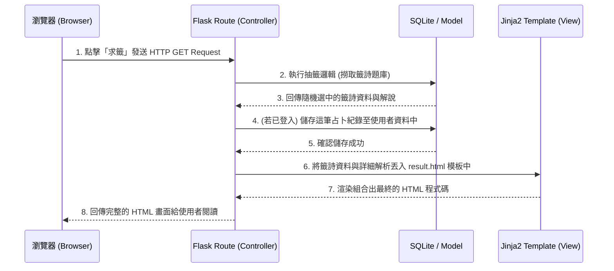

# 系統架構文件 (Architecture) - 線上算命系統

## 1. 技術架構說明

本專案採用經典的 Web 後端渲染架構，不採取前後端分離，藉此達到快速開發、降低維護成本的目的，適合 MVP (最小可行性產品) 快速上線。

- **選用技術與原因**：
  - **後端框架：Python + Flask**。Flask 輕量且極具強大擴充彈性，使用門檻低，非常適合用來快速建立路由與處理線上測算的邏輯。
  - **模板引擎：Jinja2**。無縫整合於 Flask 中，可以在伺服器端將動態資料（如籤詩詳解、會員歷史紀錄）渲染成 HTML 結構寄回給瀏覽器，也能提升搜尋引擎抓取效率 (SEO)。
  - **資料庫：SQLite**。作為輕量級關聯式資料庫，它不需額外架設資料庫伺服器，將資料儲存在專案內的實體檔案中，便於開發階段迅速建置開發環境及備份。
  - **前端技術：HTML / CSS / JS**。負責操作介面的設計、RWD 響應式佈局以及抽籤時的部分微互動 (如搖籤筒動畫)。

- **Flask MVC 模式說明**：
  - **Model（模型）**：負責與 SQLite 溝通的資料層，定義資料表的結構，例如：會員資料、抽籤/算命紀錄、香油錢捐獻紀錄。
  - **View（視圖）**：由 Jinja2 HTML 模板擔任，負責決定資料該如何「呈現」給使用者。
  - **Controller（控制器）**：由 Flask 的路由 (Routes) 擔任，負責接收前端使用者的操作要求，執行相對應的商業邏輯（如驗證密碼、隨機抽籤演算法），並將結果回傳給指定的 View 進行渲染。

## 2. 專案資料夾結構

以下為專案建議的資料夾樹狀圖與權責劃分：

```text
web_app_development/
├── app/
│   ├── __init__.py      ← 負責初始化 Flask 應用程式實例、載入設定與註冊擴展
│   ├── models.py        ← 資料庫模型定義 (Models)
│   ├── routes.py        ← Flask 路由與處理商業邏輯 (Controllers)
│   ├── static/          ← 靜態資源檔案目錄
│   │   ├── css/         ← 樣式表 (如 style.css)
│   │   ├── js/          ← 前端互動腳本 (如動畫效果)
│   │   └── img/         ← 圖片素材 (如系統圖標、籤詩插圖等)
│   └── templates/       ← Jinja2 HTML 模板目錄 (Views)
│       ├── base.html    ← 共用的網頁基礎外框 (包含導覽列 Header, 頁尾 Footer)
│       ├── index.html   ← 首頁 (功能介紹與入口)
│       ├── auth/        ← 會員系統相關視圖 (註冊、登入 HTML)
│       ├── divination/  ← 測算相關視圖 (搖籤頁、籤詩詳解結果頁)
│       └── profile/     ← 會員專區 (查看歷史算命紀錄、香油錢紀錄)
├── instance/
│   └── database.db      ← SQLite 資料庫實體檔案 (通常不在 Git 版控中)
├── docs/                ← 專案設計文件目錄
│   ├── PRD.md           ← 產品需求文件
│   └── ARCHITECTURE.md  ← 系統架構文件 (本文件)
├── requirements.txt     ← Python 第三方套件依賴清單
├── config.py            ← 專案參數設定檔 (如金流設定、密碼鹽、資料庫位置)
└── app.py               ← 系統啟動入口 (執行此檔啟動 Flask 開發伺服器)
```

## 3. 元件關係圖

以下展示使用者在網站上操作「進行抽籤並觀看結果」時，系統各元件之間的互動與資料流向：



## 4. 關鍵設計決策

1. **不使用前後端分離架構**
   - **原因**：為了最快驗證市場需求與 MVP（最小可行性產品），單體的 Flask 專案省去了開發 RESTful API 和前端 SPA（單頁應用）之間的串接溝通時間。

2. **基於 Session 的會員狀態驗證**
   - **原因**：相較於 JWT (JSON Web Token)，在全端 Jinja2 渲染的架構下，直接採用 Flask 原生內建的 Session 機制來維持登入狀態最為安全與簡便，也容易在任何一份 HTML Template 裡面呼叫 `current_user` 來判斷 UI 呈現。

3. **預留給真實金流的資料庫設計**
   - **原因**：MVP 階段的「捐香油錢」雖為模擬付款流程，但資料庫 Schema (如 `Donation` 資料表) 會在一開始就設計出 `transaction_id`（交易單號）與 `payment_status`（付款狀態）。這樣在未來擴充真實串接 Line Pay 或綠界金流時，不必大改資料庫結構即可直接過渡。

4. **模組化的算命運算邏輯**
   - **原因**：預計後續會加入「塔羅牌」、「紫微斗數」等多種測算模式，因此在架構上 `routes.py` 只會做流程控制，實際的「怎麼抽出卡牌/籤詩」邏輯將會透過獨立的模組函式處理，以確保路由層的整潔。
