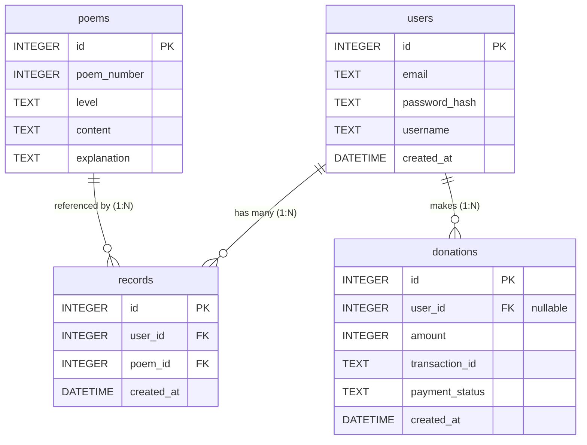

# 資料庫設計文件 (DB Design) - 線上算命系統

根據 PRD 與 FLOWCHART 需求，以下為本專案的 SQLite 資料庫設計。

## 1. ER 圖（實體關係圖）

## 2. 資料表詳細說明

### `users` (會員資料表)
- `id`: INTEGER, Primary Key, Auto Increment, 唯一識別碼。
- `email`: TEXT, 必填, 唯一，帳號登入用。
- `password_hash`: TEXT, 必填，安全雜湊加密過的密碼。
- `username`: TEXT, 必填，系統中顯示的問題/名稱。
- `created_at`: DATETIME, 必填，建立時間，預設為 `CURRENT_TIMESTAMP`。

### `poems` (籤詩題庫表)
- `id`: INTEGER, Primary Key, Auto Increment, 唯一識別碼。
- `poem_number`: INTEGER, 必填，籤的編號（例如 1、2、3）。
- `level`: TEXT, 必填，吉凶等級（例如：大吉、中吉、下下）。
- `content`: TEXT, 必填，籤詩本文內容。
- `explanation`: TEXT, 必填，解籤文字與建議。

### `records` (歷史占卜紀錄表)
- `id`: INTEGER, Primary Key, Auto Increment, 唯一識別碼。
- `user_id`: INTEGER, 必填，Foreign Key 對應 `users.id`，抽籤的會員。
- `poem_id`: INTEGER, 必填，Foreign Key 對應 `poems.id`，對應抽中的哪一張籤。
- `created_at`: DATETIME, 必填，抽籤時間，預設為 `CURRENT_TIMESTAMP`。

### `donations` (香油錢捐獻紀錄表)
- `id`: INTEGER, Primary Key, Auto Increment, 唯一識別碼。
- `user_id`: INTEGER, 選填，Foreign Key 對應 `users.id` (允許非登入訪客捐獻所以可為 NULL)。
- `amount`: INTEGER, 必填，捐獻金額。
- `transaction_id`: TEXT, 必填，唯一交易序號，作為金流對帳用途。
- `payment_status`: TEXT, 必填，付款狀態（如 `pending`, `paid`, `failed`）。
- `created_at`: DATETIME, 必填，訂單建立時間，預設為 `CURRENT_TIMESTAMP`。

## 3. SQL 建表語法
完整的 CREATE TABLE 語法將儲存於 `database/schema.sql` 中。

## 4. Python Model 程式碼
依據上述規格建置 CRUD 操作，統一存放在 `app/models/` 目錄底下，直接使用 `sqlite3` 提供的方法。
