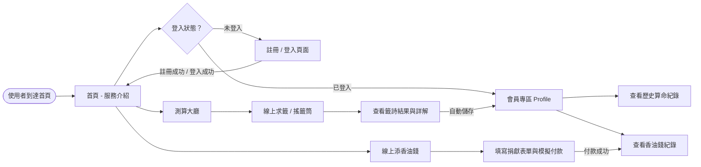
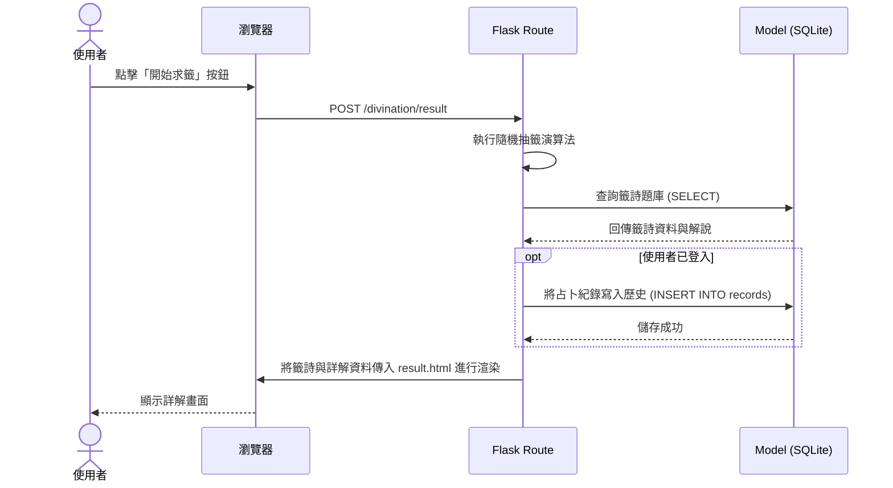

# 流程圖文件 (Flowchart) - 線上算命系統

根據 [PRD.md](PRD.md) 與 [ARCHITECTURE.md](ARCHITECTURE.md) 的設計，以下視覺化呈現使用者的操作路徑與系統資料流。

## 1. 使用者流程圖 (User Flow)

描述使用者進入網站後的各項操作路徑。

## 2. 系統序列圖 (Sequence Diagram)

描述「使用者進行求籤並自動儲存紀錄」的核心系統流程。

## 3. 功能清單對照表

依照系統需求，對應的 HTTP Route 設計。

| 功能區塊 | 子功能 | URL 路徑 | HTTP 方法 | 說明 |
| :--- | :--- | :--- | :--- | :--- |
| **公開頁面** | 首頁資訊 | `/` | GET | 顯示網站介紹與服務入口 |
| **會員管理** | 註冊頁面 | `/auth/register` | GET | 渲染註冊表單 |
| | 送出註冊 | `/auth/register` | POST | 接收註冊表單，將資料寫入資料庫 |
| | 登入頁面 | `/auth/login` | GET | 渲染登入表單 |
| | 送出登入 | `/auth/login` | POST | 驗證帳號密碼，建立 Session |
| | 登出操作 | `/auth/logout` | GET | 清除 Session 並導回首頁 |
| **測算服務** | 測算大廳 | `/divination` | GET | 列出並選擇測算項目（如：抽籤） |
| | 求籤頁面 | `/divination/draw` | GET | 顯示籤筒與求籤動畫介面 |
| | 抽籤結果與詳解 | `/divination/result` | POST | 計算結果、顯示詳解，登入狀態下自動儲存 |
| **會員專區** | 個人中心 | `/profile` | GET | 顯示使用者的算命與捐獻歷史紀錄 |
| **捐獻服務** | 添香油錢表單 | `/donation` | GET | 顯示香油錢捐獻與祈福表單 |
| | 處理模擬付款 | `/donation/pay` | POST | 處理付款邏輯並將交易狀態寫入資料庫 |
