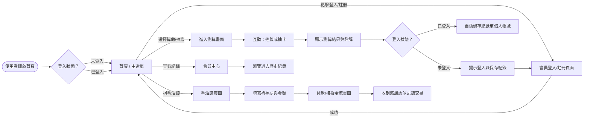
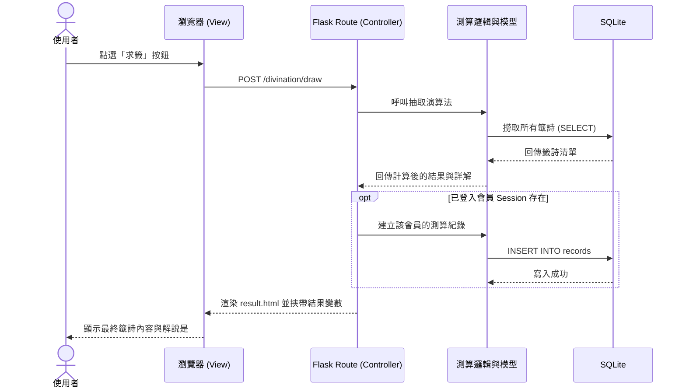

# 流程圖文件 (Flowchart) - 線上算命系統

本文件根據產品需求文件 (PRD) 與系統架構文件 (Architecture) 繪製，詳細呈現使用者在網站上的整體操作流向，以及系統內部的資料互動順序。

## 1. 使用者流程圖（User Flow）

描述使用者從開啟網頁到體驗各項核心功能（抽籤、看紀錄、捐香油錢等）的操作路徑。

## 2. 系統序列圖（Sequence Diagram）

以下描述「使用者進行抽籤並將結果存入資料庫」的核心流程。

## 3. 功能清單對照表

列出系統主要功能對應的路由與 HTTP 方法。

| 功能名稱 | 對應 URL 路徑 | HTTP 方法 | 說明 |
| -------- | ----------- | --------- | ---- |
| 網站首頁 | `/` | GET | 顯示主要介紹、選單入口 |
| 註冊頁面 | `/auth/register` | GET, POST | 呈現註冊表單與處理註冊邏輯 |
| 登入頁面 | `/auth/login` | GET, POST | 呈現登入表單與核對帳密 |
| 登出 | `/auth/logout` | GET (或 POST) | 清除 Session 並導向首頁 |
| 開始測算/抽籤 | `/divination/draw` | GET, POST | 呈現求籤畫面、處置求籤要求 |
| 詳解結果頁 | `/divination/result/<id>` | GET | 讀取特定籤詩或紀錄進行詳細解說 |
| 個人歷史紀錄 | `/profile` | GET | 列出該會員所有測算紀錄清單 |
| 捐獻香油錢表單 | `/donation` | GET | 填寫祈福與金額畫面 |
| 結帳與處理 | `/donation/checkout`| POST | 處理付款模擬、變更交易狀態 |
